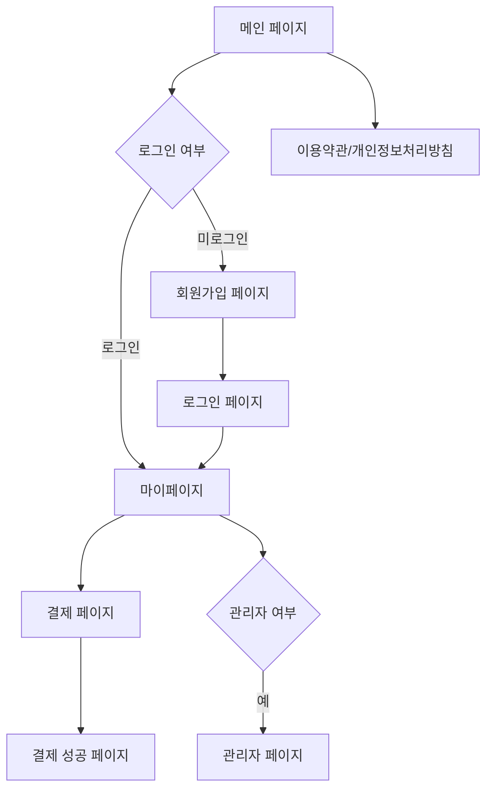

## 1. 제품 개요
숙명여자대학교 개교 120주년 기념 동문회 MVP 웹사이트로, 동문 회원 가입, 결제, 회원 관리 기능을 제공합니다. 동문들의 소속감을 강화하고 행사 참여 및 후원을 독려하는 것을 목표로 합니다.

## 2. 핵심 기능

### 2.1 사용자 역할

| 역할 | 가입 방식 | 핵심 권한 |
|------|---------------------|------------------|
| 일반 동문 | 이메일/비밀번호 가입 | 마이페이지 접근, 결제, 회원 정보 수정 |
| 관리자 | 관리자 코드로 승격 | 전체 회원 관리, 결제 내역 조회, 설정 관리 |

### 2.2 기능 모듈

우리 웹사이트 요구사항은 다음 주요 페이지로 구성됩니다:

1. **메인 페이지**: 히어로 섹션, 네비게이션, 행사 정보, 소개
2. **회원가입 페이지**: 이메일 인증, 비밀번호 설정, 개인정보 입력
3. **로그인 페이지**: 이메일/비밀번호 로그인
4. **마이페이지**: 회원 정보 조회 및 수정, 결제 내역, 탈퇴
5. **관리자 페이지**: 회원 관리, 결제 내역, 시스템 설정
6. **이용약관/개인정보처리방침 페이지**: 약관 표시
7. **결제 페이지**: Toss Payments 위젯 통한 결제
8. **결제 성공 페이지**: 결제 완료 확인

### 2.3 페이지 상세

| 페이지명 | 모듈명 | 기능 설명 |
|---------|--------|-----------|
| 메인 페이지 | 히어로 섹션 | 120주년 기념 주제 배너, 애니메이션 효과 |
| 메인 페이지 | 네비게이션 | 로고, 메뉴 링크, 로그인 상태 표시 |
| 메인 페이지 | 행사 정보 | 주요 행사 카드, 날짜, 장소 |
| 메인 페이지 | 소개 섹션 | 동문회 소개 텍스트, 연혁 |
| 회원가입 페이지 | 가입 폼 | 이메일, 비밀번호, 이름, 졸업년도, 학과 입력 |
| 회원가입 페이지 | 이메일 인증 | Firebase Auth 이메일 인증 처리 |
| 회원가입 페이지 | 약관 동의 | 이용약관, 개인정보처리방침 동의 체크박스 |
| 로그인 페이지 | 로그인 폼 | 이메일, 비밀번호 입력, 로그인 버튼 |
| 로그인 페이지 | 비밀번호 찾기 | 비밀번호 재설정 이메일 발송 |
| 마이페이지 | 회원 정보 | 이름, 이메일, 졸업정보, 가입일 표시 |
| 마이페이지 | 정보 수정 | 이름, 졸업년도, 학과 수정 기능 |
| 마이pae지 | 결제 내역 | 결제 금액, 날짜, 상태 목록 |
| 마이페이지 | 탈퇴 | 계정 삭제 기능, 확인 절차 |
| 관리자 페이지 | 회원 관리 | 전체 회원 목록, 검색, 필터, 삭제 |
| 관리자 페이지 | 결제 관리 | 전체 결제 내역, 상태 변경 |
| 관리자 페이지 | 설정 관리 | 결제 금액 설정, 공지사항 |
| 이용약관/개인정보처리방침 페이지 | 약관 표시 | 약관 내용 스크롤 가능한 영역 |
| 결제 페이지 | 결제 위젯 | Toss Payments 위젯으로 결제 진행 |
| 결제 페이지 | 결제 금액 | 시스템 설정에서 정의된 금액 표시 |
| 결제 성공 페이지 | 결제 확인 | 결제 완료 메시지, 주문번호, 금액 |

## 3. 핵심 프로세스

### 일반 사용자 플로우
1. 사용자가 웹사이트에 접속하여 메인 페이지를 봅니다.
2. 회원가입 버튼을 클릭하여 이메일, 비밀번호, 개인정보를 입력하고 가입합니다.
3. 이메일 인증을 완료하여 계정을 활성화합니다.
4. 로그인 후 마이페이지에서 회원 정보를 확인하고 수정할 수 있습니다.
5. 결제 페이지에서 Toss Payments를 통해 결제를 진행합니다.
6. 결제 성공 페이지에서 결제 완료를 확인합니다.

### 관리자 플로우
1. 관리자는 로그인 후 관리자 페이지에 접근합니다.
2. 회원 목록을 조회하고 검색/필터 기능을 사용합니다.
3. 결제 내역을 확인하고 상태를 관리합니다.
4. 시스템 설정에서 결제 금액 등을 관리합니다.

## 4. 사용자 인터페이스 디자인

### 4.1 디자인 스타일
- **주 색상**: 숙명여자대학교 공식 브랜드 색상 (진한 파란색 계열)
  - Primary: #0047AB (Royal Blue)
  - Secondary: #1E3A8A (Dark Blue)
  - Accent: #60A5FA (Light Blue)
- **버튼 스타일**: 둥근 모서리 (border-radius: 8px), 호버 효과
- **폰트**: Apple SD Gothic Neo, Malgun Gothic, sans-serif
  - 제목: 24px, 20px
  - 본문: 16px
  - 작은 텍스트: 14px
- **레이아웃**: 카드 기반 레이아웃, 상단 고정 네비게이션
- **아이콘**: Heroicons 또는 Lucide 아이콘 사용

### 4.2 페이지 디자인 개요

| 페이지명 | 모듈명 | UI 요소 |
|---------|--------|---------|
| 메인 페이지 | 히어로 섹션 | 전체 폭 배너, 진한 파란색 그라디언트 배경, 120주년 텍스트, 부드러운 페이드인 애니메이션 |
| 메인 페이지 | 네비게이션 | 상단 고정, 로고 왼쪽, 메뉴 오른쪽, 흰색 배경, 호버 시 파란색 강조 |
| 메인 페이지 | 행사 정보 | 그리드 레이아웃, 카드 형태, 그림자 효과, 호버 시 카드 상승 애니메이션 |
| 회원가입 페이지 | 가입 폼 | 중앙 정렬 카드, 최대 너비 400px, 입력 필드 라운드, 파란색 테두리 포커스 |
| 결제 페이지 | 결제 위젯 | Toss Payments 위젯 통합, 반응형 레이아웃, 진한 파란색 CTA 버튼 |
| 푸터 | 사업자 정보 | 짙은 회색 배경, 흰색 텍스트, 사업자등록번호, 대표자명, 주소 (PG 결제 승인용) |

### 4.3 반응형 디자인
- **데스크톱 우선**: 1024px 이상에서 최적화된 레이아웃
- **모바일 적응형**: 768px 이하에서 1열 레이아웃으로 자동 변환
- **터치 최적화**: 모바일 기기에서 버튼 크기 최소 44px, 터치 영역 확보
- **반응형 네비게이션**: 모바일에서 햄버거 메뉴로 변환
