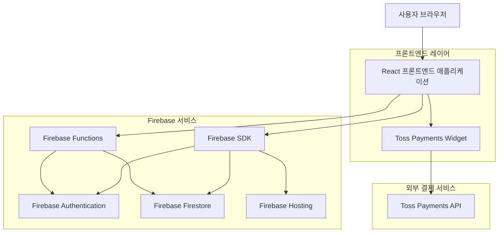
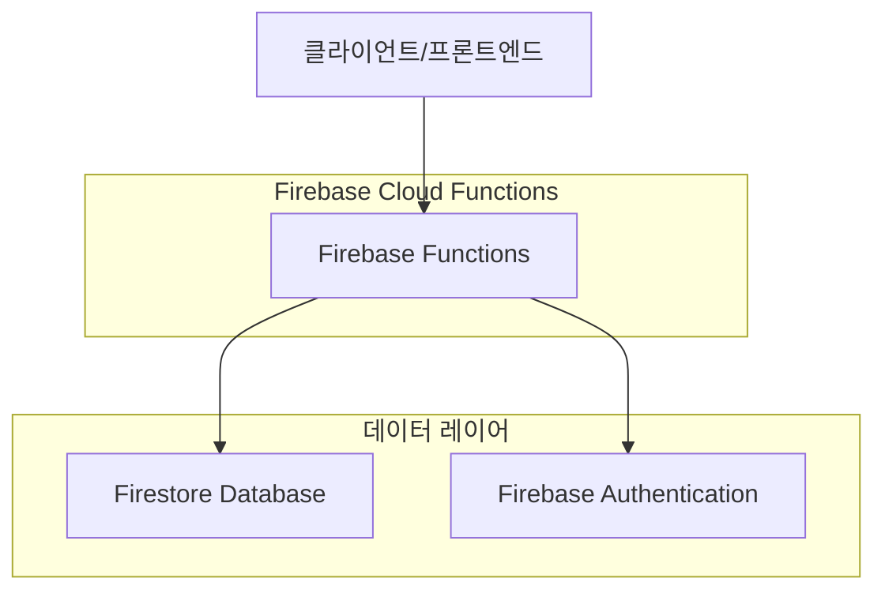
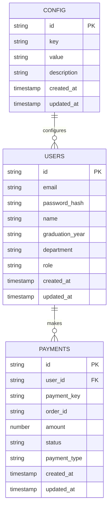
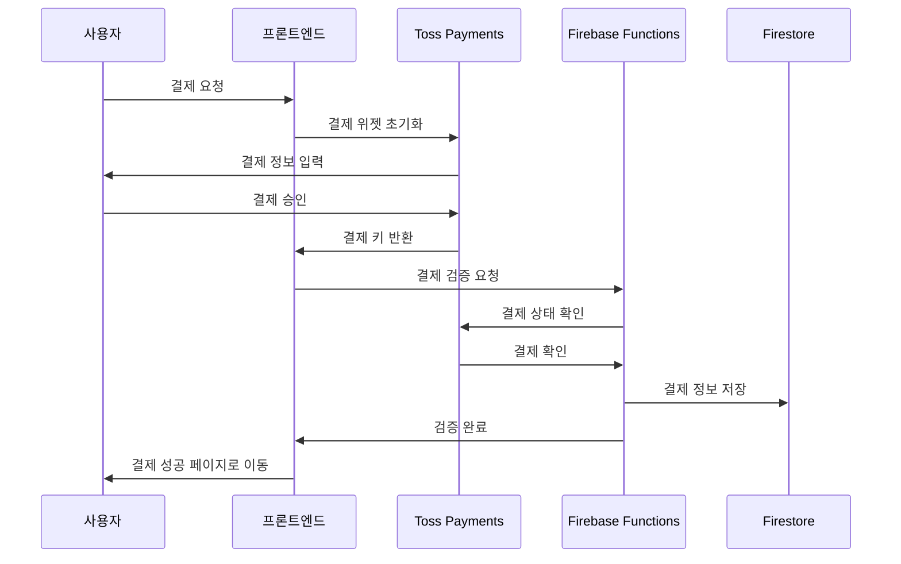

## 1. 아키텍처 설계



## 2. 기술 스택

- **프론트엔드**: React@18 + TypeScript@5 + Vite@5 + Tailwind CSS@3
- **백엔드**: Firebase (Auth, Firestore, Functions, Hosting)
- **결제**: Toss Payments (Widget 방식)

## 3. 라우트 정의

| 라우트 | 목적 |
|-------|------|
| / | 메인 페이지, 행사 정보 및 소개 |
| /register | 회원가입 페이지, 이메일 인증 |
| /login | 로그인 페이지 |
| /mypage | 마이페이지, 회원 정보 및 결제 내역 |
| /admin | 관리자 페이지, 회원 및 결제 관리 |
| /policy | 이용약관 및 개인정보처리방침 페이지 |
| /checkout | 결제 페이지, Toss Payments 위젯 |
| /success | 결제 성공 페이지 |

## 4. API 정의

### 4.1 Firebase Functions API

#### 사용자 관리
```
POST /api/users/create-admin
```

Request:
| Param Name | Param Type | isRequired | Description |
|-----------|-----------|------------|-------------|
| email | string | true | 관리자 이메일 |
| adminCode | string | true | 관리자 승격 코드 |

Response:
| Param Name | Param Type | Description |
|-----------|-----------|-------------|
| success | boolean | 관리자 생성 성공 여부 |
| message | string | 결과 메시지 |

#### 결제 검증
```
POST /api/payments/verify
```

Request:
| Param Name | Param Type | isRequired | Description |
|-----------|-----------|------------|-------------|
| paymentKey | string | true | Toss 결제 키 |
| orderId | string | true | 주문 ID |
| amount | number | true | 결제 금액 |

Response:
| Param Name | Param Type | Description |
|-----------|-----------|-------------|
| success | boolean | 결제 검증 성공 여부 |
| paymentData | object | 결제 데이터 |

## 5. 서버 아키텍처 다이어그램



## 6. 데이터 모델

### 6.1 데이터 모델 정의



### 6.2 데이터 정의 언어

#### Users Collection (users)
```typescript
// create collection
{
  collection: "users",
  documentStructure: {
    id: string, // Firebase Auth UID
    email: string,
    name: string,
    graduation_year: string,
    department: string,
    role: "user" | "admin",
    created_at: FirebaseFirestore.Timestamp,
    updated_at: FirebaseFirestore.Timestamp
  },
  indexes: [
    { field: "email", order: "ASC" },
    { field: "role", order: "ASC" },
    { field: "created_at", order: "DESC" }
  ]
}
```

#### Payments Collection (payments)
```typescript
// create collection
{
  collection: "payments",
  documentStructure: {
    id: string, // Auto-generated
    user_id: string,
    payment_key: string,
    order_id: string,
    amount: number,
    status: "pending" | "completed" | "failed" | "cancelled",
    payment_type: "membership" | "donation" | "event",
    created_at: FirebaseFirestore.Timestamp,
    updated_at: FirebaseFirestore.Timestamp
  },
  indexes: [
    { field: "user_id", order: "ASC" },
    { field: "status", order: "ASC" },
    { field: "created_at", order: "DESC" },
    { field: "payment_key", order: "ASC" }
  ]
}
```

#### Config Collection (config)
```typescript
// create collection
{
  collection: "config",
  documentStructure: {
    id: string, // Auto-generated
    key: string,
    value: string,
    description: string,
    created_at: FirebaseFirestore.Timestamp,
    updated_at: FirebaseFirestore.Timestamp
  },
  indexes: [
    { field: "key", order: "ASC" }
  ]
}
```

#### 초기 데이터
```typescript
// initial config data
[
  {
    key: "payment_amount",
    value: "10000",
    description: "기본 회비 결제 금액"
  },
  {
    key: "admin_code",
    value: "SOOKMYUNG2024",
    description: "관리자 승격 코드"
  }
]
```

## 7. Firebase 보안 규칙

```typescript
// Firestore Security Rules
rules_version = '2';
service cloud.firestore {
  match /databases/{database}/documents {
    
    // Users collection
    match /users/{userId} {
      allow read: if request.auth != null && (request.auth.uid == userId || get(/databases/$(database)/documents/users/$(request.auth.uid)).data.role == 'admin');
      allow create: if request.auth != null;
      allow update: if request.auth != null && (request.auth.uid == userId || get(/databases/$(database)/documents/users/$(request.auth.uid)).data.role == 'admin');
      allow delete: if request.auth != null && (request.auth.uid == userId || get(/databases/$(database)/documents/users/$(request.auth.uid)).data.role == 'admin');
    }
    
    // Payments collection
    match /payments/{paymentId} {
      allow read: if request.auth != null && (resource.data.user_id == request.auth.uid || get(/databases/$(database)/documents/users/$(request.auth.uid)).data.role == 'admin');
      allow create: if request.auth != null && request.resource.data.user_id == request.auth.uid;
      allow update: if false; // Payments should not be updated directly
      allow delete: if request.auth != null && get(/databases/$(database)/documents/users/$(request.auth.uid)).data.role == 'admin';
    }
    
    // Config collection - admin only
    match /config/{configId} {
      allow read: if true; // Public read for frontend
      allow write: if request.auth != null && get(/databases/$(database)/documents/users/$(request.auth.uid)).data.role == 'admin';
    }
  }
}
```

## 8. Toss Payments 통합

### 8.1 결제 플로우



### 8.2 Toss Payments 설정

```typescript
// Toss Payments Client Configuration
const tossPaymentsConfig = {
  clientKey: process.env.VITE_TOSS_CLIENT_KEY,
  customerKey: (userId: string) => `user_${userId}`,
  successUrl: `${window.location.origin}/success`,
  failUrl: `${window.location.origin}/checkout`
};
```

## 9. 배포 환경

- **프론트엔드**: Firebase Hosting
- **백엔드**: Firebase Functions (us-central1)
- **데이터베이스**: Firestore (asia-northeast3)
- **인증**: Firebase Authentication

## 10. 환경 변수

```typescript
// .env
VITE_FIREBASE_API_KEY=
VITE_FIREBASE_AUTH_DOMAIN=
VITE_FIREBASE_PROJECT_ID=
VITE_FIREBASE_STORAGE_BUCKET=
VITE_FIREBASE_MESSAGING_SENDER_ID=
VITE_FIREBASE_APP_ID=
VITE_TOSS_CLIENT_KEY=
```
